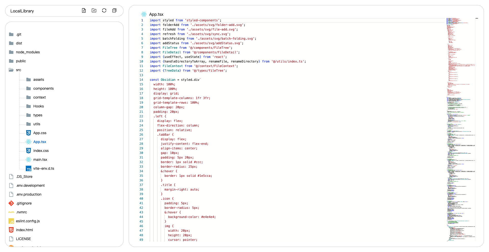

  
  <h2 align="center" style="font-weight: 600">LocalLibrary</h2>

  LocalLibrary是基于 React+TypeScript 实现的在线前端项目编辑器，能操作本地文件，同时具有媒体文件、文档文件的预览功能

  

## ✨ 1.0 特性

- 🛠 使用 TypeScript + React 编写
- ✅ 读取文件夹形成文件树
- 🪐 支持代码编辑器
- 💪 修改文件内容实时保存
- 🐆 支持新建文件、文件夹
- 🤟 支持修改文件、文件夹
- 🥇 支持删除文件、文件夹
- 🦩 媒体文件（图片、视频）预览功能
- ✂️ 文档文件（docx、xls、xlsx、pdf）预览功能
- 🪐 markdown 双栏编辑+预览功能
- 📃 可用于 react 项目入门
- ☝️ 欢迎提出需求和 bug
- 🛠 更多特性开发中

## 👀 界面一览

  

